# Lab 2
## using gdb
> Q1:Looking at the backtrace output,which function called syscall?

执行backtrace后结果如下：

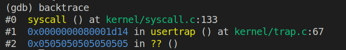

由图可知是函数`usertrap()`调用了`syscall()`函数.

> Q2:What is the value of `p->trapframe->a7` and what does that value represent?(Hint:look `user/initcode.S`,the first user program xv6 starts.)

首先输入两次n之后执行结果如下：

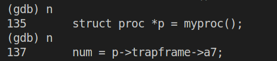

语句`struct proc *p = myproc()`执行完毕，接着执行`p/x *p`看p的内容如下：

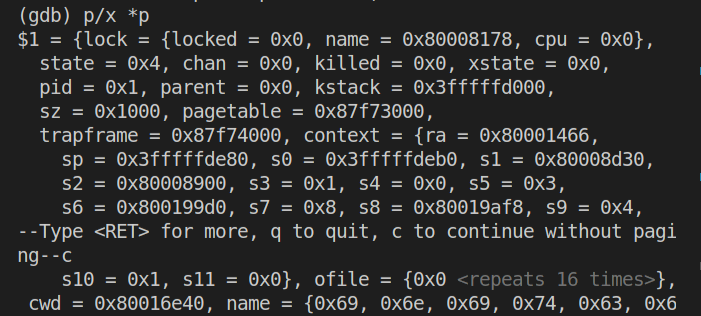

此时查看`p->trapframe->a7`的值：

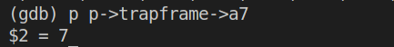

得到`a7`的值为`7`。
根据`user/initcode.S`以及参考书第二章内容可知寄存器`a7`保存了系统将要执行的系统调用号，这里的系统调用号为`7`,由`kernel/syscall.h`的内容（下图）可知系统调用为`SYS_exec`。

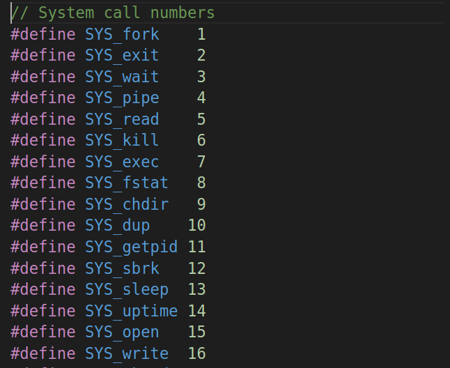

> Q3:What was the previous mode that the CPU was in?

在gdb中输入`p /x $sstatus`得到如下结果：


其值转换为二进制为：`0b100010`,在参考书[RISC-V privileged instructions](https://github.com/riscv/riscv-isa-manual/releases/download/Priv-v1.12/riscv-privileged-20211203.pdf)中找到sstatus的值定义如下：

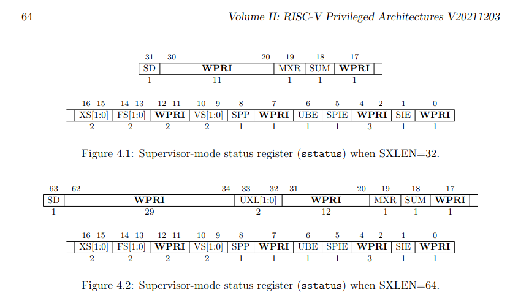

同时对于其`SPP`位有描述如下：

> The SPP bit indicates the privilege level at which a hart was executing before entering supervisor mode. When a trap is taken, SPP is set to 0 if the trap originated from user mode, or 1 otherwise. When an SRET instruction (see Section 3.3.2) is executed to return from the trap handler, the privilege level is set to user mode if the SPP bit is 0, or supervisor mode if the SPP bit is 1; SPP is then set to 0.
> 
> SPP 位指示进入管理员模式之前 hart 执行的特权级别。 当采取陷阱时，如果陷阱源自用户模式，则 SPP 设置为 0，否则设置为 1。 当执行 SRET 指令（见第 3.3.2 节）从陷阱处理程序返回时，如果 SPP 位为 0，则特权级别设置为用户模式，如果 SPP 位为 1，则设置为超级用户模式； 然后将 SPP 设置为 0。


因此，因为此时`SPP`位为`0`,所以在`syscall`之前系统处于用户模式(`User mode`)。

> Q4:Write down the assembly instruction the kernel is panicing at.Which register corresponds to the varialable num?

首先按照指导将`kernel/syscall.c`中`syscall`函数中的`num = p->trapframe->a7`改为`num = * (int *) 0`,接着执行`make qemu`得到如下输出：

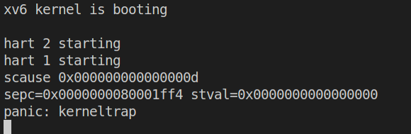

在`kernel/kernel.asm`中查找上图中的`sepc`值，得到结果如下图：

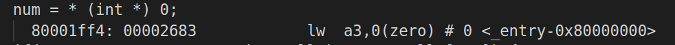

对应的汇编指令为`lw a3,0(zero)`,由参考书[RISC-V Assembly Language](https://web.eecs.utk.edu/~smarz1/courses/ece356/notes/assembly/),

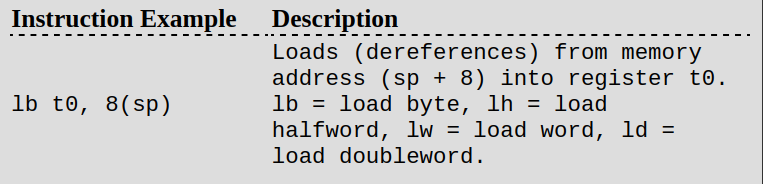

这条汇编代码代表：将内存中地址从`0`开始的一个字`word(2bytes)`大小的数据加载到寄存器`a3`中。

> Q5:Why does the kernel crash?Hint:look at figure 3-3 in the text;is address 0 mapped in the kernel address space?Is that confirmed by the value in scause above?(See
description of scause in RISC-V privileged instructions)

首先按照实验要求在上文`panic`的代码处打上断点并继续执行，结果如下：

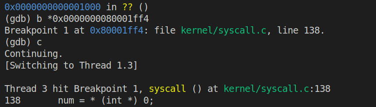

此时再次输入`n`并执行会引起内核`panic`,如下：


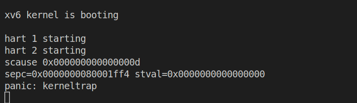

使用`Ctrl+C`来退出当前线程并打印`scause`的值如下：

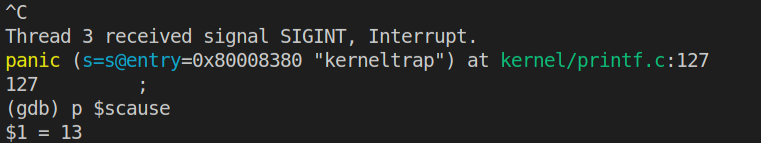

接着开始分析：首先根据参考书[book-riscv-rev3](https://pdos.csail.mit.edu/6.828/2022/xv6/book-riscv-rev3.pdf)中的`Figure 3.3`(如下图)，

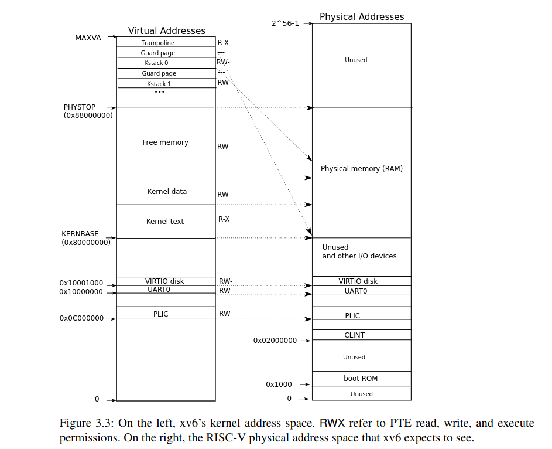

内核地址空间基地址为`0x80000000`,因此代码中的数据地址`0`不映射到内核地址空间中，因此内核会崩溃。

而`scause`的值为13，在参考书[RISC-V Assembly Language](https://web.eecs.utk.edu/~smarz1/courses/ece356/notes/assembly/)的`Table 8.6`(如下图)中可以查到代码`13`对应`Load page fault`，验证了结论。

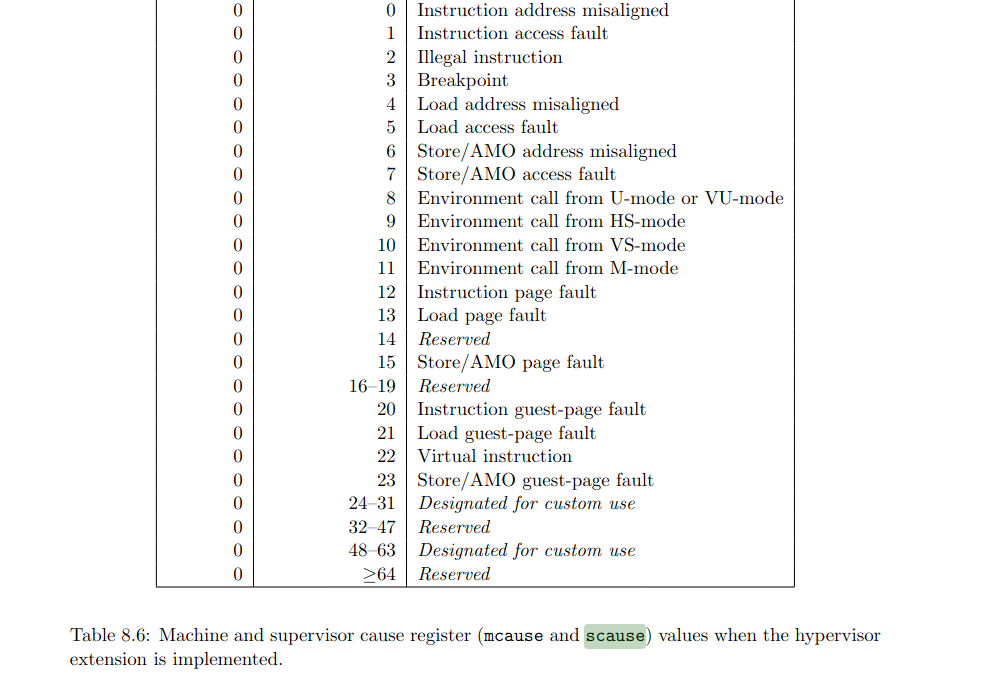

> Q6:What is the name of the binary that was running when the kernel paniced? What is its process id (pid)? 

首先重启`qemu`和`gdb`执行如下命令:

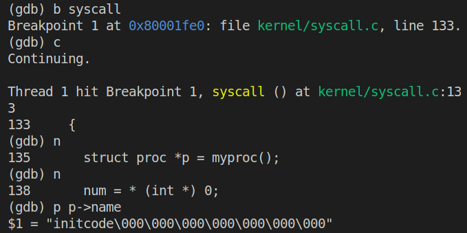

为了获得进程`pid`,执行如下命令：


因此

`name = initcode\000\000\000\000\000\000\000`;

`pid = 1`.

## System call tracing
### 主要思路
- 根据题中所给的Hints来修改程序
  - `Makefile`:Add `$U/_trace` to `UPROGS`.
  - `user/user.h`: 增加`trace`函数的声明，如下：
    ```c
    int trace(int);
    ```
  - `user/usys.pl`:增加如下代码：
    ```c
    entry("trace");
    ```
  - `kernel/proc.h`:在`struct proc`中添加成员变量`mask`,用于存储`trace`函数的参数`1 << SYS_call`:
    ```c
    struct proc{
      uint64 mask;
      ...
    };
    ```
  - `kernel/sysproc.c`:增加函数`sys_trace`如下：
    ```c
    uint64
    sys_trace(void)
    {
      int mask;
      argint(0, &mask); // 从系统调用中获得参数mask
    
      struct proc* p = myproc();
      p->mask = mask; // 将当前进程的mask值设为获取的参数
    
      return 0;
    }
    ```
    用于在调用`trace`时来接收参数`mask`.
  - `kernel/proc.c`:在`fork`函数中增加如下代码：
    ```c
    fork(void){
      ...
      np->sz = p->sz;
    
      // 复制trace mask值到子进程
      np->mask = p->mask;
    
      // copy saved user registers.
      *(np->trapframe) = *(p->trapframe);
      ...
    }
    ```
    上述代码实现将掩码`mask`从父进程传到子进程.
  - `kernel/syscall.h`:增加系统调用号`SYS_trace`:
    ```c
    #define SYS_trace 22
    ```
  - `kernel/syscall.c`:
    - 增加函数声明：
      ```c
      extern uint64 sys_trace(void);
      ```
    - 增加`syscalls`的取值：
      ```c
      static uint64 (*syscalls[])(void) = {
      ...
      [SYS_close]   sys_close,
      [SYS_trace]   sys_trace,
      };
      ```
    - 增加系统调用名的字符串数组：
      ```c
      // 用来在打印trace函数运行结果时输出系统调用名称
      static char* syscall_names[] = {
        "",
        "syscall fork",
        "syscall exit",
        "syscall wait",
        "syscall pipe",
        "syscall read",
        "syscall kill",
        "syscall exec",
        "syscall fstat",
        "syscall chdir",
        "syscall dup",
        "syscall getpid",
        "syscall sbrk",
        "syscall sleep",
        "syscall uptime",
        "syscall open",
        "syscall write",
        "syscall mknod",
        "syscall unlink",
        "syscall link",
        "syscall mkdir",
        "syscall close",
        "syscall trace",
      };
      ```
    - 修改`syscall`函数：
      ```c
      void
      syscall(void)
      {
        ...
        if(num > 0 && num < NELEM(syscalls) && syscalls[num]) {
          // Use num to lookup the system call function for num, call it,
          // and store its return value in p->trapframe->a0
          p->trapframe->a0 = syscalls[num]();
      
          if((p->mask >> num) & 0b1){ // 如果mask的值译码后等于该系统调用的系统调用号，则打印相关信息
            printf("%d: %s -> %d\n", p->pid, syscall_names[num], p->trapframe->a0);
          }
        } else {
          printf("%d %s: unknown sys call %d\n",
            p->pid, p->name, num);
          p->trapframe->a0 = -1;
        }
      }
      ```
      上述改动中内层条件判断的语句就是将`mask`进行解码，然后与1作比较，若相等则输出该系统调用.
      

经过以上对内核的修改，成功实现了系统调用`trace`.

## sysinfo
### 主要思路
- 和上个实验一样按照`Hints`来逐步完成，本实验的主要目的是完成系统调用`sysinfo`来统计系统非空闲进程数量和空闲空间字节数.
  - 首先是将系统调用添加到内核中,参考`System call tracing`,进行如下操作：
    - Add `$U/_sysinfotest` to `UPROGS` in `Makefile`
    - 在`user/user.h`中进行系统调用函数的声明：
      ```c
      struct sysinfo;
      ...
      int sysinfo(struct sysinfo *);
      ...
      ```
    - 在`user/usys.pl`中添加如下代码：
      ```c
      ...
      entry("trace");
      entry("sysinfo");
      ```
    - 在`kernel/syscall.h`中添加系统调用号：
      ```c
      #define SYS_sysinfo 23
      ```
    - 在`kernel/syscall.c`中添加如下改动：
      ```c
      ...
      extern uint64 sys_info(void);
      
      // An array mapping syscall numbers from syscall.h
      // to the function that handles the system call.
      static uint64 (*syscalls[])(void) = {
      ...
      [SYS_sysinfo]    sys_info,
      };
      
      // 用来在打印trace函数运行结果时输出系统调用名称
      static char* syscall_names[] = {
        ...
        "syscall sysinfo"
      };
      ...
      ```
  - 接着就是实现该系统调用，该系统调用的功能是统计空闲内存和非空闲进程
    - 统计空闲内存：在`kernel/kalloc.c`中添加如下函数
      ```c
      // 用于统计空闲空间的大小，free_num计算得到的是页数，每页的大小为 4096 bytes
      uint64
      free_mem_num(void)
      {
        struct run *page;
        uint64 free_num = 0;
        acquire(&kmem.lock);  // 访问上锁
        page = kmem.freelist; // 空闲页面的链表头
        while (page) {
          free_num++;
          page = page->next;
        }
        release(&kmem.lock);  // 访问结束解锁        
        return free_num * 4096;
      }
      ```
    - 统计非空闲进程：在`kernel/proc.c`中添加如下函数
      ```c
      // 用于统计当前非空闲进程数量
      uint64
      proc_used_num(void)
      {
        uint64 nproc = 0;  // 计数
        for (struct proc *p = proc; p < &proc[NPROC]; p++) {
          if (p->state != UNUSED)
            nproc++;
        }
        return nproc;
      }
      ```
    - 在实现上述函数后要将二者的声明加入到`kernel/defs.h`中.
    - 在`kernel/sysproc.c`中实现系统调用`uint64 sys_info(void)`:
      ```c
      uint64
      sys_info(void)
      {
        // 用户空间指向sysinfo的指针
        uint64 u_addr;
        argaddr(0, &u_addr);
      
        struct sysinfo info;
        info.freemem = free_mem_num(); // 获取空闲内存
        info.nproc = proc_used_num();  // 获取非空闲进程
      
        struct proc *p = myproc();
        // 根据Hints参考kernel/file.c/filestate()使用copy函数将info复制到用户空间
        if(copyout(p->pagetable, u_addr, (char*)(&info), sizeof(info)) < 0)
          return -1;
      
        return 0;
      }
      ```

## 参考链接
- [xv6-labs-2022 Lab2 system call 详解](https://www.chens.life/posts/mit-xv6-lab2/)
- [MIT6.s081-2020 操作系统入门 Lab2 System Calls](https://zhuanlan.zhihu.com/p/407169754#Sysinfo)
- 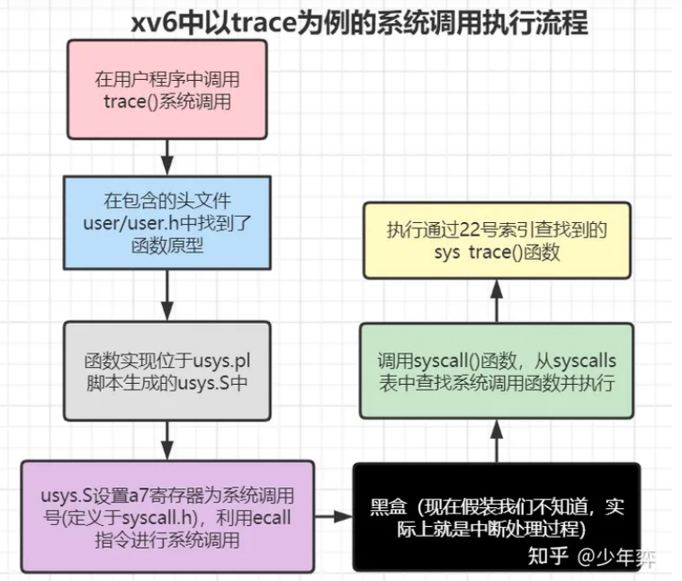