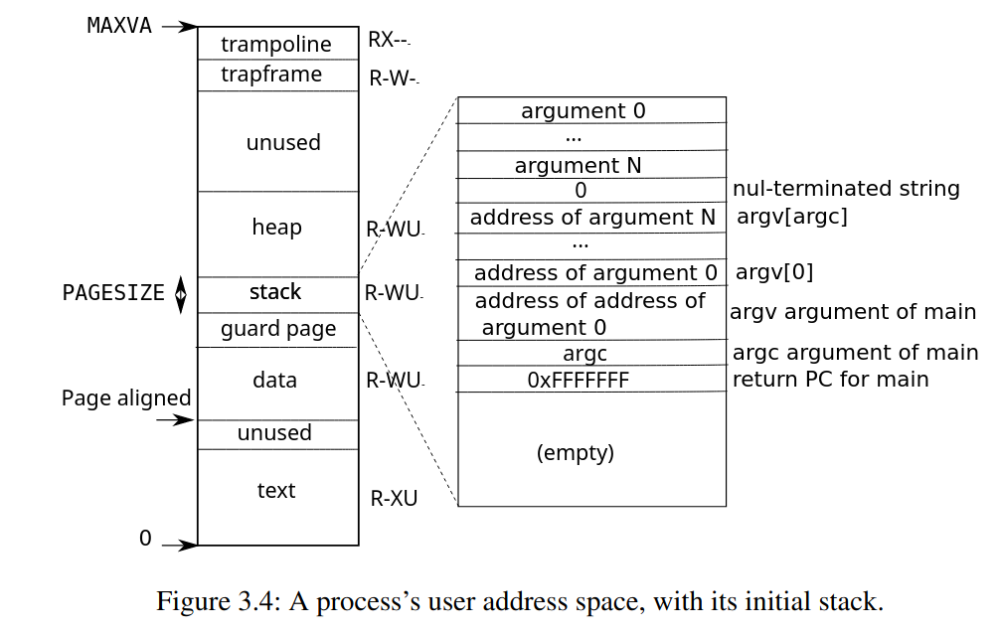
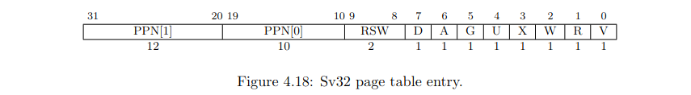

# Lab3 page tables
## Speed up system calls
### 主要思路
根据题中所给的`Hints`以及参考书的`Chapter 3`,要实现对`getpid()`的加速，就是将进程的`pid`信息存放在内核和用户共用的一片存储空间中，从而在`ugetpid()`的时候程序不用陷入内核态，实现对`getpid()`的加速。
实现流程如下：
- 首先在`kernel/proc.h`中添加如下代码来作为上述共享空间：
  ```c
  struct usyscall *usyspage;   // 用户与内核共享页
  ```
- 接着在`kernel/proc.c`中添加如下代码来为这个页面分配空间并将目标值装入页面：
  ```c
  static struct proc*
  allocproc(void)
  {
    ...
    // Allocate a trapframe page.
    if((p->trapframe = (struct trapframe *)kalloc()) == 0){
      freeproc(p);
      release(&p->lock);
      return 0;
    }
  
    // 给共享页分配空间(add)
    if((p->usyspage = (struct usyscall *)kalloc()) == 0){
      freeproc(p);
      release(&p->lock);
      return 0;
    }
    p->usyspage->pid = p->pid;
  
    ...
  
    return p;
  }
  ```
- 在销毁进程时要记得将页面空间释放并避免野指针(`kernel/proc.c`)：
  ```c
  static void
  freeproc(struct proc *p)
  {
   ...
  
    if(p->usyspage)
      kfree((void*)p->usyspage);
    p->usyspage = 0;
  
    ...
  }
  ```
- 在页表中建立映射(`kernel/proc.c`),注意题中要求，该页的权限为用户只读:
  ```c
  // Create a user page table for a given process, with no user memory,
  // but with trampoline and trapframe pages.
  pagetable_t
  proc_pagetable(struct proc *p)
  {
    ...
  
    // 建立从USYSCALL到p->usyspage的映射，权限为用户只读
    if(mappages(pagetable, USYSCALL, PGSIZE,
                (uint64)(p->usyspage), PTE_R | PTE_U) < 0){
      uvmfree(pagetable, 0);
      return 0;
    }
  
    // map the trampoline code (for system call return)
    // at the highest user virtual address.
    // only the supervisor uses it, on the way
    // to/from user space, so not PTE_U.
    ...
  }
  ```
- 同样在进程结束释放页表的时候要记得取消映射(`kernel/proc.c`)：
  ```c
  // Free a process's page table, and free the
  // physical memory it refers to.
  void
  proc_freepagetable(pagetable_t pagetable, uint64 sz)
  {
    ...
  
    uvmunmap(pagetable, USYSCALL, 1, 0);
    uvmfree(pagetable, sz);
  }
  ```
> Q:Which other xv6 system call(s) could be made faster using this shared page? Explain how. 

系统调用`sys_sbrk`也可以用此页来加速，因为该函数返回的是`myproc()->sz`,因此我们可以将`myproc()->sz`也在进程初始化的时候存在该页中，就像存进程的`pid`一样，用同样的原理可以加速此系统调用。

## Print a page table
### 主要思路
根据`Hints`来写，首先要输出所有页表项我们需要对三层页表进行遍历，页表是树状结构，遍历的历程参考`Hints`给出的`freewalk()`函数。
- 在`kernel/defs.h`中定义`vmprint`函数：
  ```c
  void            vmprint(pagetable_t);
  ```
- 在`kernel/exec.c`中添加题目要求的代码：
  ```c
  ...
  if(p->pid==1) vmprint(p->pagetable);
  return argc; // this ends up in a0, the first argument to main(argc, argv)
  ...
  ```
- 接着在`kernel/vm.c`中实现`vmprint`函数(仿照`freewalk`函数)：
  ```c
  static uint64 depth = 0; // 来记录递归搜索深度
  void
  vmprint(pagetable_t page)
  {
    if(depth == 0)           // 根地址打印
    {
      printf("page table %p\n", page);
    }
    for(int i = 0; i < 512; ++i)  // 遍历页面上的页表项
    {
      pte_t pte = page[i];   
      if(pte & PTE_V)        // 页表项有效
      {
        for(int j = 0; j <= depth; ++j)
        { 
          printf(" ..");
        }
        printf("%d: pte %p pa %p\n", i, (uint64)pte, (uint64)PTE2PA(pte));  // 分别打印虚拟地址和物理地址
  
        if(depth < 2) // 一级或二级页表递归搜索子页表项
        {
          depth ++;
          vmprint((pagetable_t)PTE2PA(pte));
          depth --;
        }
      } 
    }
  }
  ```

> Q:Explain the output of vmprint in terms of Fig 3-4 from the text. What does page 0 contain? What is in page 2? When running in user mode, could the process read/write the memory mapped by page 1? What does the third to last page contain? 

`Figure 3.4`如下：



对于三层页表的存储内容，我们需要对`exec`函数进行分析，因为页表在这里被创建。
首先我们可以看到`exec`函数中与内存操作相关的第一处是如下代码：
```c
  // Load program into memory.
  for(i=0, off=elf.phoff; i<elf.phnum; i++, off+=sizeof(ph)){
    if(readi(ip, 0, (uint64)&ph, off, sizeof(ph)) != sizeof(ph))
      goto bad;
    if(ph.type != ELF_PROG_LOAD)
      continue;
    if(ph.memsz < ph.filesz)
      goto bad;
    if(ph.vaddr + ph.memsz < ph.vaddr)
      goto bad;
    if(ph.vaddr % PGSIZE != 0)
      goto bad;
    uint64 sz1;
    if((sz1 = uvmalloc(pagetable, sz, ph.vaddr + ph.memsz, flags2perm(ph.flags))) == 0)
      goto bad;
    sz = sz1;
    if(loadseg(pagetable, ph.vaddr, ip, ph.off, ph.filesz) < 0)
      goto bad;
  }
```
由此`page 0`所存储的应该是这些数据，如代码段，数据段等.

接着涉及内存操作的代码如下：
```c
  // Allocate two pages at the next page boundary.
  // Make the first inaccessible as a stack guard.
  // Use the second as the user stack.
  sz = PGROUNDUP(sz);
  uint64 sz1;
  if((sz1 = uvmalloc(pagetable, sz, sz + 2*PGSIZE, PTE_W)) == 0)
    goto bad;
  sz = sz1;
  uvmclear(pagetable, sz-2*PGSIZE);
  sp = sz;
  stackbase = sp - PGSIZE;
```
这段代码申请了两页的空间，其中第一页`page 1`作为`Figure 3.4`中`guard page`段,第二页作为`Figure 3.4`中`stack`段。

由函数`uvmclear`的定义，`page 1`的`PTE_U`位被置为0,因此用户程序无法访问`page 1`。

由`Figure 3.4`，第三页到最后一页包括了`heap`,`unused`,`trapframe`,`trampoline`.

## Detect which pages have been accessed
### 主要思路
本题要求我们对给定的有限个数的页面，程序可以检查这些页面是否被访问过，并且将结果编成`bitmask`输出到用户空间的指定地址。

首先需要确定怎么去查询一个页面是否被访问：参考[RISC-V privileged instructions](https://github.com/riscv/riscv-isa-manual/releases/download/Priv-v1.12/riscv-privileged-20211203.pdf)中的`Figure 4.18`：



以及`page 81`的如下描述：
> Each leaf PTE contains an accessed (A)and dirty (D) bit.The A bit indicates the virtual page has
been read,written,or fetched from since the last time the A bit was cleared.The D bit indicates
the virtual page has been written since the last time the D bit was cleared.

我们知道可以用`PTE_A`作为页面是否被访问的标志，它的值是`PTE`的第六位(从零开始)，因此我们在`kernel/riscv.h`中添加如下代码：
```c
#define PTE_A (1L << 6)
```
若`PTE & PTE_A == 1`,则说明此页面在检查前被访问过。

如何去得到一页中的`PTE`呢？根据`Hints`,我们可以用`walk`函数，它可以找到一个虚拟地址对应的`PTE`，返回其`physical address`。

再根据`Hints`的第8条，我们需要在检查完毕后将`PTE_A`位置零，因为检查本身相当于一次访问，若不置零则`PTE_A`位必然是1，下一次进行检查时就可能出现页面并未被访问但是PTE_A位为1的情况。这要求我们在检查完一个页面后就将`PTE`的第六位置零，参考[如何将一个二进制值的指定位设置为指定的值](https://www.chens.life/posts/how-to-set-a-specified-bit-of-a-binary-value-to-a-specified-value/),将二进制数`x`的第`n`位设置为`a`的公式为`x = ((x&(1 << n)) ^ x) ^ (a << n)`。

在遍历的过程中如何设置`bitmask`呢？我采用如下代码：
```c
if(PTE_FLAGS(*pte) & PTE_A)  // 访问位为1，代表被访问过
{
  maskbits |= (1L << i);
}
```
这样`maskbits`的第`i`位为1则表示第`i`页被访问过。

综合以上分析以及`Hints`中所给的其他的提示，最终补全`sys_pgaccess`代码如下：
```c
int
sys_pgaccess(void)
{
  // lab pgtbl: your code here.
  uint64 base;        // 待检查页面起始地址
  int pagenum;        // 待检查页面数
  uint64 usraddr;     // 等待输出结果的用户空间地址

  // 获取参数
  argaddr(0, &base);
  argint(1, &pagenum);
  argaddr(2, &usraddr);

  // bitmask
  uint64 maskbits = 0;
  struct proc* p = myproc();

  for(int i = 0; i < pagenum; ++i)
  {
    pte_t* pte = walk(p->pagetable, base + i * PGSIZE, 0);  // 获取第i页的第0个页表项映射的物理地址
    if(pte == 0)  panic("page not exist!");
    if(PTE_FLAGS(*pte) & PTE_A)  // 访问位为1，代表被访问过
    {
      maskbits |= (1L << i);
    }
    *pte = ((*pte & PTE_A) ^ *pte) ^ 0;  // 将PTE_A置零
  }
  
  if (copyout(p->pagetable, usraddr, (char *)&maskbits, sizeof(maskbits)) < 0) // 将bitmask的结果输出到用户空间
    panic("sys_pgacess copyout error");
  
  return 0;
}
```

## Lab3参考链接
- [MIT 6.S081 2020 LAB3记录](https://zhuanlan.zhihu.com/p/347172409)
- [6.S081 Lab3 page tables](https://blog.csdn.net/ahundredmile/article/details/125531126)
- [xv6-labs-2022 Lab3 page tables 详解](https://www.chens.life/posts/mit-xv6-lab3/)
